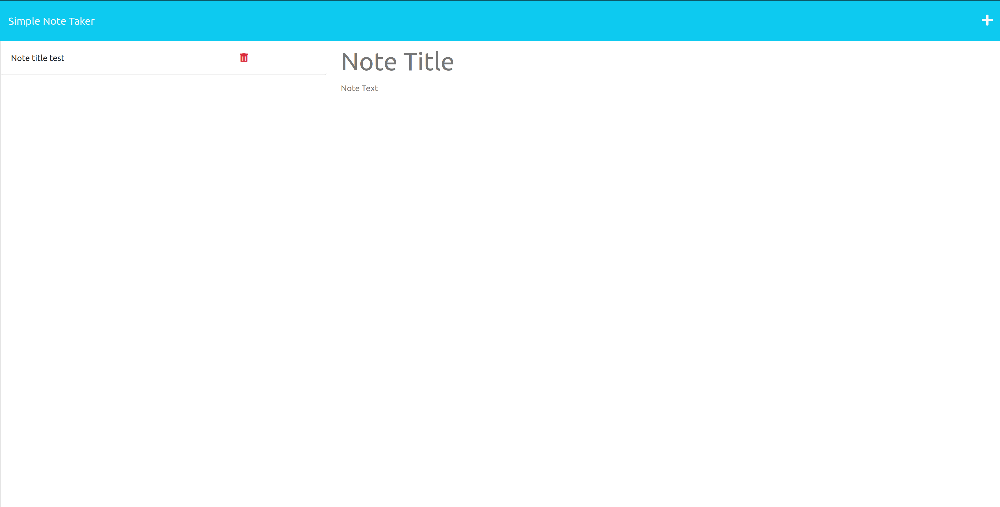
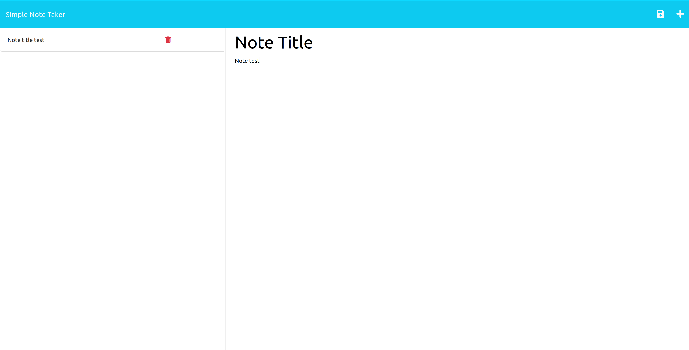

# Simple Note Taker

## Table of Contents
- [Description](#description)
- [License](#license)
- [Installation](#installation)
- [Usage](#usage)
- [Credits](#credits)
	- [Resources](#resources)
- [Tests](#tests)
- [Issues/Questions](#issuesquestions)
- [Contributing](#contributing)
- [Source Code](#source-code)

## Description
A simple note taking app that is used to write and save notes from a server.

## License

## Installation
First, clone the repo at `git@github.com:ryansheehy0/Simple_Note_Taker.git`.  Second, run `npm install` in the Develop folder in the folder you just cloned.  Third, run `node server.js` and you should see a message in your terminal saying "Listening on port 3000."  And finally, go to `http://localhost:3000` in your browser to use the app.

## Usage
Click on the "Get Started" button and type your notes title and note text. Then click the save button that appeared in the top right. Now you should see your saved note in the left hand side. If you want to delete a note just click the trash can icon.

You can check out the website through this [link](https://ryansheehy0-simple-note-taker-5524ccb13c33.herokuapp.com/)

## Credits

### Resources
- [express](https://www.npmjs.com/package/express)
- [uuid](https://www.npmjs.com/package/uuid)

## Tests
Just [install](#installation) the project and follow the steps for [using](#usage) the app.

## Issues/Questions
On the [github page](https://github.com/ryansheehy0/Simple_Note_Taker) just click on the issues tab and then click the New issue button. Please try to leave a description of your problem and what steps you took that lead to the problem.

If you have any questions or issues feel free to reach out to me at

Guthub: [ryansheehy0](https://github.com/ryansheehy0)

or

Email: ryansheehy0@gmail.com

## Contributing
Just clone the repo, make your changes, push to a new branch, and make a pull request on github.

## Source Code
This source code can be found within the folder Develop. The server files include server.js, readAndWrite.js, and newUUID.js